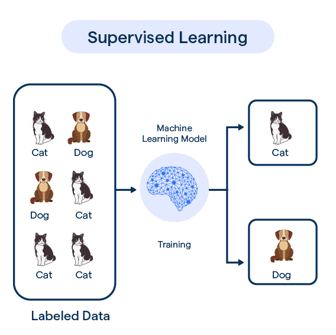

# Classification problem

* Predict a discrete valued output (yes/no) or (A, B, C, D)

## What kind of an animal is it? Is it a cat, a dog, a tiger?
X:
    * height
    * weight
    * size of ears,
    * size of tail
    * color, color of the eyes
    * ...
    * OR the picture of an animal

## Medical diagnosis
X:
    * Lab results
    * Images (CT, MRI, Ultrasound)
    * Patient metadata

* Brest Cancer:  Tumor size (x). Is it malignant or benign (y)? Two distinct possibilities. Given a tumor (and its size) what is the probability that it is malignant?
* The Tumor size is a "feature". In other problems we might have many more features.
* e.g. We might know the tumor size, the age of the patient, the gender of the patient, etc.

## Iris species
* Classical example from the paper of Ronald Fisher in 1936: "The use of multiple measurements in taxonomic problems"
* y:
    * Iris-setosa
    * Iris-versicolor
    * Iris-virginica
* X:
    * sepal and petal length and width (4 numbers)
* 

[image source](https://cdn.botpenguin.com/assets/website/Supervised_Learning_2ae4dbc912.png)
