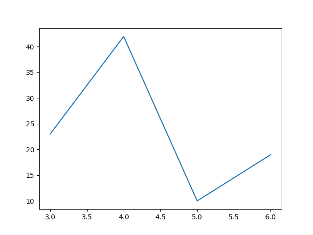

# Matplotlib Line



The numbers in the two lists are the values of the x and y axis respectively.

[documentation of matplotlib.pyplot.plot](https://matplotlib.org/stable/api/_as_gen/matplotlib.pyplot.plot.html)

